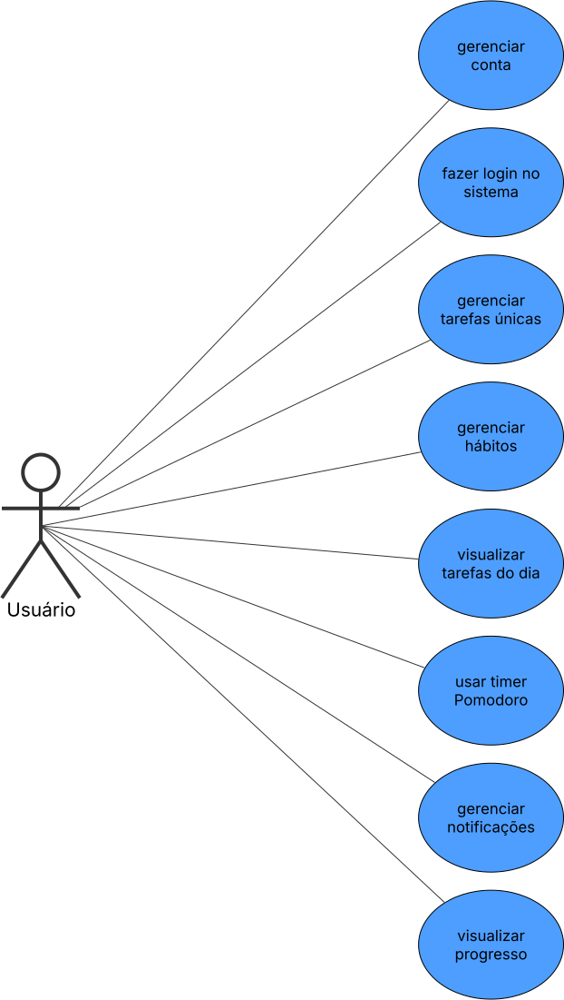
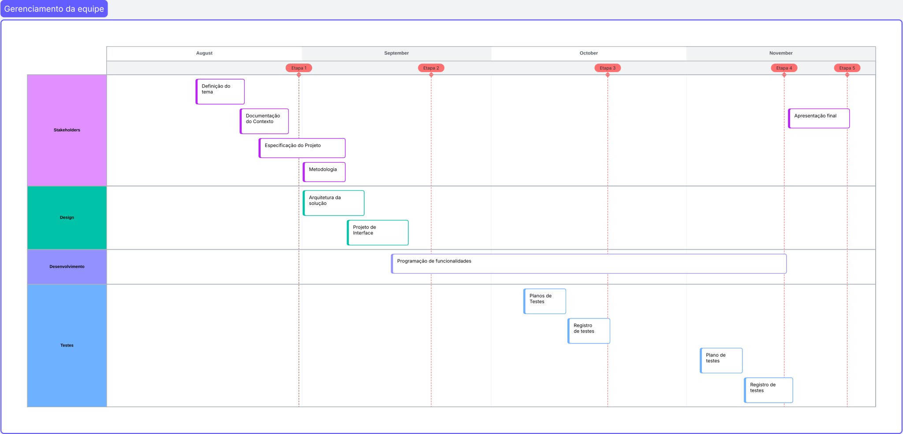
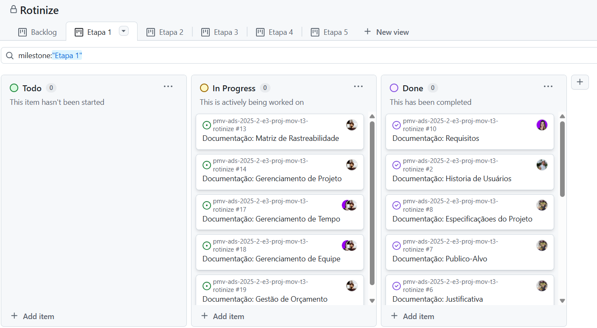

# Especificações do Projeto

Diagrama de Personas: Representações semi-fictícias dos usuários ideais. As personas ajudam a humanizar o público-alvo, permitindo que a equipe de projeto compreenda suas motivações, frustrações e objetivos.

Histórias de Usuários: Descrições curtas e simples de uma funcionalidade, contadas a partir da perspectiva do usuário. Elas seguem o formato por exemplo: "Como um [tipo de usuário], eu quero [uma funcionalidade], para que [razão/benefício]".

Requisitos Funcionais: Detalham o que o sistema deve fazer. São as funcionalidades e os comportamentos específicos do aplicativo, como "O usuário deve poder adicionar uma nova tarefa" ou "O aplicativo deve gerar um gráfico de progresso".

Requisitos Não Funcionais: Descrevem como o sistema deve se comportar. Eles incluem aspectos como desempenho, segurança, usabilidade, acessibilidade e compatibilidade com diferentes dispositivos.

Restrições do Projeto: Fatores que limitam o escopo ou o processo do projeto, como orçamento, cronograma, tecnologias disponíveis e regulamentações.

## Personas 

👤 Persona 1 – Pedro Paulo, o Arquiteto Ambicioso
- Idade: 26 anos
- Profissão: Arquiteto recém-formado, autônomo
- Personalidade: Sonhador, curioso, determinado, mas um pouco desorganizado
- Objetivos: Fazer mestrado fora do país, crescer profissionalmente
- Comportamento digital: Pesquisa muito, baixa apps de produtividade, mas não mantém o uso
- Frustrações: Esquece prazos, não consegue manter uma rotina de estudos
- Cliente ideal para: Funcionalidades de planejamento visual, lembretes de tarefas, metas semanais
- Motivadores: Desenvolvimento pessoal, viagens, autonomia

Mapa de Empatia – Pedro Paulo (Arquiteto Ambicioso)

|Seção| Detalhes |
|--------------------|------------------------------------|
|O que pensa e sente?  | Quer ser presente na família e eficiente no trabalho. Sente que está sempre apagando incêndios.         |
|O que vê?       | Tarefas acumuladas, compromissos esquecidos, filhos com atividades escolares, clientes exigentes.             |
|O que ouve?     |“Você esqueceu a reunião da escola.” “Tem entrega amanhã.” “Você precisa delegar mais.”                        |
|O que fala e faz? |Diz que está tentando se organizar, usa o celular para tudo, mas não consegue integrar vida pessoal e profissional |
|Dores           |Sobrecarga, falta de tempo, sensação de estar falhando em casa e no trabalho.  |
|Ganhos          |Quer um app que permita compartilhar rotinas com a família, automatizar tarefas e integrar compromissos em um só lugar. |

👤 Persona 2 – Mariana, a Estudante Multitarefa
- Idade: 22 anos
- Profissão: Estudante de Engenharia
- Personalidade: Organizada, ansiosa, disciplinada, mas sobrecarregada
- Objetivos: Equilibrar estudos, estágio e vida pessoal
- Comportamento digital: Usa apps de calendário, anotações e produtividade
- Frustrações: Perde prazos por excesso de tarefas, dificuldade em priorizar
- Cliente ideal para: Planejamento semanal, alertas inteligentes, categorização de tarefas
- Motivadores: Eficiência, controle, sucesso acadêmico

  Mapa de Empatia – Mariana (Estudante Multitarefa)

|Seção| Detalhes |
|--------------------|------------------------------------|
|O que pensa e sente? |Se sente sobrecarregada com estágio, faculdade e vida pessoal. Quer dar conta de tudo, mas vive ansiosa.     |
|O que vê?       | Agenda lotada, colegas que também estão estressados, professores exigentes.                 |
|O que ouve?     | “Você precisa se organizar melhor.” “Não esquece do relatório.” “Você está sempre correndo.” |
|O que fala e faz?| Reclama da falta de tempo, tenta usar planners e apps, mas se perde com excesso de tarefas. |
|Dores           | Ansiedade, esquecimento de prazos, dificuldade em priorizar. |
|Ganhos          |Quer um app que simplifique sua rotina, com alertas inteligentes e planejamento semanal eficiente. |

👤 Persona 3 – Roberto, o Pai Empreendedor
- Idade: 40 anos
- Profissão: Dono de uma pequena empresa
- Personalidade: Prático, responsável, multitarefa, valoriza tempo com a família
- Objetivos: Organizar compromissos profissionais e familiares
- Comportamento digital: Usa celular para tudo, prefere apps simples e diretos
- Frustrações: Esquece compromissos familiares, sente que perde tempo com tarefas repetitivas
- Cliente ideal para: Rotinas compartilhadas, tarefas recorrentes, integração com calendário
- Motivadores: Equilíbrio entre trabalho e vida pessoal, praticidade

    Mapa de Empatia – Roberto (Pai Empreendedor)

|Seção| Detalhes | 
|--------------------|------------------------------------|
|O que pensa e sente?  | Quer ser presente na família e eficiente no trabalho. Sente que está sempre apagando incêndios. |
|O que vê?       | Tarefas acumuladas, compromissos esquecidos, filhos com atividades escolares, clientes exigentes. |
|O que ouve?     |“Você esqueceu a reunião da escola.” “Tem entrega amanhã.” “Você precisa delegar mais.” |
|O que fala e faz?|Diz que está tentando se organizar, usa o celular para tudo, mas não consegue integrar vida pessoal e profissional |
|Dores           |Sobrecarga, falta de tempo, sensação de estar falhando em casa e no trabalho. |
|Ganhos          |Quer um app que permita compartilhar rotinas com a família, automatizar tarefas e integrar compromissos em um só lugar. |

👤 Persona 4 – Lucas, o Jovem com TDAH
- Idade: 24 anos
- Profissão: Estudante de Publicidade e freelancer em design gráfico
- Personalidade: Criativo, impulsivo, distraído, sensível a estímulos visuais
- Objetivos: Melhorar foco e organização para concluir projetos
- Comportamento digital: Usa muitos apps, mas abandona se forem complexos
- Frustrações: Esquece tarefas, se perde em atividades longas, baixa produtividade
- Cliente ideal para: Interface visual, microtarefas, notificações frequentes e motivacionais
- Motivadores: Autonomia, reconhecimento, leveza na rotina

    Mapa de Empatia – Lucas (Jovem com TDAH)

|Seção| Detalhes |
|--------------------|------------------------------------|
|O que pensa e sente?  | Se sente frustrado por não conseguir manter o foco. Quer ser mais produtivo, mas se sente sobrecarregado com tarefas grandes. Tem medo de parecer irresponsável. |
|O que vê?       | Muitos apps complexos, rotinas que parecem impossíveis de seguir, colegas que conseguem se organizar melhor. |
|O que ouve?     |“Você precisa se concentrar mais.” “Por que você esqueceu de novo?” “Use um planner.” |
|O que fala e faz?|Diz que vai tentar se organizar, baixa vários apps, começa empolgado mas abandona rápido. Se distrai com redes sociais. |
|Dores           |Esquecimento constante, dificuldade em concluir tarefas, baixa autoestima por não conseguir manter rotina. | 
|Ganhos          |Quer uma rotina leve, visual, com lembretes frequentes e recompensas por progresso. Deseja autonomia e foco. |

👤 Persona 5 – Camila, a Fitness Atarefada
- Idade: 30 anos
- Profissão: Analista de marketing em uma startup
- Personalidade: Determinada, disciplinada, focada em resultados, mas vive na correria
- Objetivos: Manter rotina saudável mesmo com agenda cheia
- Comportamento digital: Usa apps de treino, nutrição e produtividade; gosta de métricas
- Frustrações: Pula treinos por falta de tempo, esquece refeições planejadas
- Cliente ideal para: Planejamento de treinos e refeições, alertas inteligentes, modo “dia corrido”
- Motivadores: Saúde, desempenho, equilíbrio

    Mapa de Empatia – Camila (Fitness Atarefada)

|Seção| Detalhes |
|--------------------|------------------------------------|
|O que pensa e sente?  | Quer manter sua disciplina, mas se sente culpada quando não consegue cumprir treinos ou refeições. Acredita que está perdendo o controle. |
|O que vê?       | Agenda lotada, notificações constantes, colegas que também lutam para manter hábitos saudáveis. |
|O que ouve?     |“Você está sempre ocupada.” “Como consegue treinar todo dia?” “Não esquece de comer direito.” |
|O que fala e faz?|Fala que precisa de mais tempo, tenta organizar tudo no celular, mas acaba pulando treinos. Usa apps de saúde, mas não integra tudo. |
|Dores           |Falta de tempo, sobrecarga mental, dificuldade em manter consistência nos hábitos. |
|Ganhos          |Quer um app que simplifique sua rotina, com alertas inteligentes, modo rápido e visualização de progresso. Deseja equilíbrio e praticidade. |

Quadro de Relação entre Personas e Stakeholder
|Persona| Papel no Projeto |Interesse      | Estratégia de Comunicação |
|--------------------|------------------------------------|----------------------------------------|---------|
|Pedro Paulo  | Usuário final | Alto |Lembretes de prazos, metas visuais |
|Mariana | Usuário final |Alto  |Planejamento semanal, alertas inteligentes |
|Roberto |Usuário final |Alto  |Rotinas compartilhadas, integração familiar  |
|Lucas   |Usuário final |Alto | Interface visual, microtarefas, motivação  |
|Camila  |Usuário final |Alto | Modo rápido, alertas de treino, progresso  |

## Histórias de Usuários
As histórias de usuário abaixo foram elaboradas com base nas personas definidas no projeto. Elas representam os principais comportamentos, expectativas e necessidades dos usuários e stakeholders envolvidos, servindo como base para a definição dos requisitos funcionais e não funcionais da aplicação.
Com base na análise das personas forma identificadas as seguintes histórias de usuários:

CONTEXTO: Organização Pessoal e Foco
|EU COMO| QUERO/PRECISO |PARA           |
|--------------------|------------------------------------|----------------------------------------|
|Lucas (com TDAH)  | Registrar tarefas com prazos        | Não esquecer compromissos importantes do mestrado          |
|Pedro Paulo    | Alterar permissões                 | Permitir que possam administrar contas |
|Mariana        |Categorizar minhas tarefas por tipo |Facilitar a organização e priorização das atividades  |

CONTEXTO: Planejamento e Produtividade
|EU COMO| QUERO/PRECISO |PARA           |
|--------------------|------------------------------------|----------------------------------------|
|Mariana  | Planejar minha semana com antecedência        | Equilibrar estudos, estágio e vida pessoal         |
|Pedro Paulo    | Visualizar metas semanais                 | Acompanhar meu progresso nos estudos |
|Roberto        |Criar tarefas recorrentes |Automatizar atividades do dia a dia  |

CONTEXTO: Notificações e Lembrete
|EU COMO| QUERO/PRECISO |PARA           |
|--------------------|------------------------------------|----------------------------------------|
|Lucas (com TDAH)  | Receber notificações frequentes e motivacionais       | Não esquecer o que preciso fazer e manter engajamento       |
|Mariana  | Receber alertas de provas e entregas             | Não perder prazos acadêmicos importantes |
|Pedro Paulo      |Receber lembretes automáticos |Manter minha rotina de estudos ativa e disciplinada |

CONTEXTO: Saúde, Bem-estar e Estilo de Vida
|EU COMO| QUERO/PRECISO |PARA           |
|--------------------|------------------------------------|----------------------------------------|
|Camila  | Agendar meus treinos e refeições      | Manter minha rotina saudável mesmo com agenda cheia      |
|Camila | Ver gráficos semanais do meu desempenho            | Acompanhar minha evolução e ajustar minha rotina |

## Modelagem do Processo de Negócio

### Análise da Situação Atual

Atualmente, os usuários que buscam organizar suas rotinas e manter hábitos saudáveis recorrem a diferentes aplicativos para cada necessidade: um app para lembretes, outro para exercícios, outro para hábitos, outro para foco e assim por diante. Essa fragmentação gera sobrecarga cognitiva, falta de integração das informações e dificuldade de acompanhamento do progresso. Mesmo os aplicativos que reúnem várias funções apresentam, em geral, interfaces complexas e pouco amigáveis, o que compromete a motivação e leva ao abandono precoce.

### Descrição Geral da Proposta

A proposta consiste em um aplicativo mobile que centralize em um único ambiente as principais funcionalidades voltadas à organização de rotinas, acompanhamento de hábitos e gestão de tarefas. Além disso, o app oferecerá relatórios visuais, notificações inteligentes e recursos de gamificação, garantindo uma experiência unificada, simples e motivadora.

### Processo 1 – Gerenciamento de Hábitos e Tarefas

**Oportunidades de melhoria:**
- Substituir o uso de múltiplos aplicativos isolados por uma única plataforma.
- Possibilitar o registro, acompanhamento e personalização de hábitos recorrentes e tarefas pontuais.
- Facilitar o acompanhamento visual do progresso do usuário.

### Processo 2 – Sistema de Foco com Técnica Pomodoro

**Oportunidades de melhoria:**
- Unificar o recurso de foco dentro do mesmo ambiente de tarefas e hábitos.
- Aumentar a concentração por meio de ciclos de produtividade e pausas estratégicas.
- Recompensar o usuário pelas conquistas e por manter consistência no uso.

## Indicadores de Desempenho

### Para o administrador

| Indicador | Objetivos | Descrição | Cálculo | Fonte dos dados | Perspectiva | 
| --------- | --------- | --------- | ------- | --------------- | ----------- |
| Adoção da Ferramenta de Hábitos | Quantificar o uso de funcionalidades chave, como a criação de hábitos, para entender seu valor para o usuário | Média de hábitos ativos por usuário ativo por semana. | Total de hábitos ativos na semana / Número de usuários ativos na semana | Tabela `Habito`, Tabela `Usuario` | Processos Internos |
| Adoção da Ferramenta de Tarefas | Quantificar o uso de funcionalidades chave, como a criação de tarefas, para entender seu valor para o usuário | Média de tarefas únicas criadas por usuário ativo na semana. | Total de tarefas criadas na semana / Número de usuários ativos na semana | Tabela `Tarefa`, Tabela `Usuario` | Processos Internos |
| Adoção da Ferramenta Pomodoro | Quantificar o uso de funcionalidades chave, como o timer de foco, para entender seu valor para o usuário | Média de sessões do timer de foco iniciadas por usuário ativo por semana. | Total de sessões de foco iniciadas na semana / Número de usuários ativos na semana | Tabela `SessaoPomodoro` | Processos Internos |
| Taxa de Aquisição de Novos Usuários | Acompanhar o crescimento da base de usuários da aplicação | Variação percentual no número de novas contas criadas a cada mês. | (Novos usuários no mês atual - novos usuários no mês anterior) / Novos usuários no mês anterior * 100 | Tabela `Usuario` | Aprendizado e Crescimento |
| Taxa de Retenção de Usuários | Avaliar a capacidade do aplicativo de manter os usuários engajados e ativos ao longo do tempo | Percentual de usuários ativos no mês atual em comparação com o total de usuários cadastrados | Usuários ativos no mês atual / Total de usuários cadastrados * 100 | Tabela `Usuario` | Clientes |

### Para o usuário

| Indicador | Objetivos | Descrição | Cálculo | Fonte dos dados | Perspectiva | 
| --------- | --------- | --------- | ------- | --------------- | ----------- |
| Taxa de Consistência em Hábitos | Quantificar a consistência do usuário nos hábitos definidos por ele | Percentual de conclusão dos objetivos de todos os hábitos no período especificado | Total de objetivos concluídos no período / Total de objetivos programados no período * 100 | Tabela `RegistroHabito` | Processos Internos |
| Taxa de Eficácia em Tarefas | Quantificar a eficácia do usuário em concluir as tarefas programadas por ele | Percentual de tarefas únicas programadas que foram efetivamente marcadas como concluídas no período especificado | Total de tarefas concluída no período / Total de tarefas programadas no período * 100 | Tabela `Tarefa` | Processos Internos |
| Tempo total de foco | Quantificar a capacidade do usuário de manter o foco | Soma de todos os períodos de foco registrados no intervalo especificado | Σ (TimeSpan das sessões de foco) | Tabela `SessaoPomodoro` | Processos Internos |
| Taxa de Aumento da Consistência em Hábitos | Acompanhar o progresso do usuário na consistência em hábitos | Variação percentual na taxa de consistência em hábitos por mês  | (Taxa de consistência no mês anterior - Taxa de consistência no mês atual) / Taxa de consistência no mês anterior | Tabela `RegistroHabito` | Aprendizado e Crescimento |
| Taxa de Aumento da Eficácia em Tarefas  | Acompanhar o progresso do usuário na eficácia em tarefas | Variação percentual na taxa de eficácia em tarefas por mês  | (Taxa de eficácia no mês anterior - Taxa de eficácia de conclusão no mês atual) / Taxa de eficácia no mês anterior | Tabela `Tarefa` | Aprendizado e Crescimento |

## Requisitos

### Requisitos Funcionais

|ID| Descrição do Requisito | Prioridade |
| --- | --- | --- |
|RF-001| O sistema deve permitir que o usuário crie uma conta. | ALTA | 
|RF-002| O sistema deve permitir que o usuário cadastrado faça o login. | ALTA |
|RF-003| O sistema deve permitir que o usuário gerencie os dados de sua conta. | MÉDIA |
|RF-004| O sistema deve permitir que o usuário crie, visualize, atualize e exclua uma tarefa de instância única. | ALTA |
|RF-005| O sistema deve permitir que o usuário crie, visualize, atualize e exclua um hábito (tarefa com recorrência especificada). | ALTA |
|RF-006| O sistema deve exibir as tarefas programadas para o dia atual, em formato de checklist. | MÉDIA |
|RF-007| O sistema deve permitir que o usuário marque as tarefas como concluídas. | MÉDIA |
|RF-008| O sistema deve fornecer um timer que alterne entre períodos de foco e de intervalo. | ALTA |
|RF-009| O sistema deve permitir que o usuário configure a duração dos períodos de foco e de intervalo do timer. | MÉDIA |
|RF-010| O sistema deve permitir que o usuário visualize hábitos e tarefas de acordo com categorias. | MÉDIA |
|RF-011| O sistema deve enviar notificações com lembretes de tarefas a realizar. | MÉDIA |
|RF-012| O sistema deve permitir que o usuário configure quais notificações gostaria de receber, em qual horário e com que frequência. | BAIXA |
|RF-013| O sistema deve conter um sistema de níveis, em que o usuário ganha pontos por completar tarefas e manter a consistência em hábitos e sobe de nível quando atinge determinada quantidade de pontos. | BAIXA |
|RF-014| O sistema deve exibir métricas de progresso do usuário em hábitos e tarefas de forma gráfica e intuitiva. | MÉDIA |
|RF-015| O sistema deve exibir dicas sobre como estabelecer hábitos de forma efetiva, conforme a ciência comportamental. | BAIXA |

### Requisitos não Funcionais

|ID     | Descrição do Requisito  |Prioridade |
|-------|-------------------------|----|
|RNF-001| A interface do usuário deve ser simples e intuitiva, de forma que um novo usuário consiga criar um hábito dentro de 60s após abrir a aplicação. | ALTA |
|RNF-002| A aplicação deve ser desenvolvida em React Native para plataformas iOS e Android. | ALTA | 
|RNF-003| As senhas de usuários devem ser criptografadas antes do armazenamento. |  MÉDIA |
|RNF-004| Interações do usuário devem ter resposta visual dentro de 1s. | BAIXA |
|RNF-005| Os dados do usuário devem ser salvos localmente, de forma que não sejam perdidos ao reiniciar o aplicativo. | ALTA |
|RNF-006| O código-fonte da aplicação deve seguir um padrão de estilo consistente e ser documentado, seguindo as boas práticas. |MÉDIA | 

## Restrições

O projeto está restrito pelos itens apresentados na tabela a seguir.

|ID| Restrição                                             |
|--|-------------------------------------------------------|
|01| O projeto deverá ser entregue até o final do semestre letivo. |
|02| O projeto deverá ser desenvolvido utilizando ferramentas e softwares gratuitos ou com licenças acadêmicas, de forma que todos os membros da equipe tenham acesso às tecnologias necessárias. |
|03| O projeto deverá ser desenvolvido utilizando uma metodologia ágil, com reuniões semanais de acompanhamento para garantir o controle das atividades e o cumprimento do cronograma estabelecido.|

## Diagrama de Casos de Uso 

# Matriz de Rastreabilidade

| ID       | DC-01 | DC-02 | DC-03 | DC-04 | DC-05 | DC-06 | DC-07 | DC-08 | RNF | R |
|----------|-------|-------|-------|-------|-------|-------|-------|-------|-----|---|
| RF-001   | X     |       |       |       |       |       |       |       |     |   |
| RF-002   |       | X     |       |       |       |       |       |       |     |   |
| RF-003   | X     |       |       |       |       |       |       |       |     |   |
| RF-004   |       |       | X     |       |       |       |       |       |     |   |
| RF-005   |       |       |       | X     |       |       |       |       |     |   |
| RF-006   |       |       |       |       | X     |       |       |       |     |   |
| RF-007   |       |       | X     | X     | X     |       |       |       |     |   |
| RF-008   |       |       |       |       |       | X     |       |       |     |   |
| RF-009   |       |       |       |       |       | X     |       |       |     |   |
| RF-010   |       |       | X     | X     |       |       |       |       |     |   |
| RF-011   |       |       |       |       |       |       | X     |       |     |   |
| RF-012   |       |       |       |       |       |       | X     |       |     |   |
| RF-013   |       |       | X     | X     |       | X     |       |       |     |   |
| RF-014   |       |       |       |       |       |       |       | X     |     |   |
| RF-015   |       |       |       | X     |       |       |       |       |     |   |
| RNF-001  | X     | X     | X     | X     | X     | X     | X     | X     | X   |   |
| RNF-002  |       |       |       |       |       |       |       |       | X   |   |
| RNF-003  | X     | X     |       |       |       |       |       |       | X   |   |
| RNF-004  |       |       |       |       |       | X     |       |       | X   |   |
| RNF-005  |       |       | X     | X     | X     |       |       |       | X   |   |
| RNF-006  |       |       |       |       |       |       |       |       | X   |   |
| R-01     |       |       |       |       |       |       |       |       |     | X |
| R-02     |       |       |       |       |       |       |       |       |     | X |
| R-03     |       |       |       |       |       |       |       |       |     | X |

# Gerenciamento de Projeto

De acordo com o PMBoK v6 as dez áreas que constituem os pilares para gerenciar projetos, e que caracterizam a multidisciplinaridade envolvida, são: Integração, Escopo, Cronograma (Tempo), Custos, Qualidade, Recursos, Comunicações, Riscos, Aquisições, Partes Interessadas. Para desenvolver projetos um profissional deve se preocupar em gerenciar todas essas dez áreas. Elas se complementam e se relacionam, de tal forma que não se deve apenas examinar uma área de forma estanque. É preciso considerar, por exemplo, que as áreas de Escopo, Cronograma e Custos estão muito relacionadas. Assim, se eu amplio o escopo de um projeto eu posso afetar seu cronograma e seus custos.

## Gerenciamento de Tempo

O projeto seguirá o seguinte cronograma de execução:

## Gerenciamento de Equipe

O gerenciamento de equipe será feito com elementos das metodologias Kanban e Scrum, refinando as tarefas e atribuições a cada milestone (representadas no diagrama da seção anterior). O uso de metodologias ágeis de gerenciamento de projeto condiz com as características do projeto atual e permite maior flexibilidade para lidar com a volatilidade dos requisitos. 

## Gestão de Orçamento

**1. Recursos Humanos**
| Função                         | Nível  | Custo Mensal (R$) | Total (4 meses) |
|--------------------------------|--------|-----------------|----------------|
| Líder de Projeto / Scrum Master | Sênior | 12.000          | 48.000         |
| Desenvolvedor Mobile 1          | Pleno  | 7.000           | 28.000         |
| Desenvolvedor Mobile 2          | Pleno  | 7.000           | 28.000         |
| UX/UI Designer                  | Pleno  | 7.000           | 28.000         |
| QA / Testes                     | Pleno  | 7.000           | 28.000         |
| **Total RH**                    | -      | 40.000          | 160.000        |

**2. Hardware**
| Item                    | Quantidade | Custo Unitário (R$) | Total (R$) |
|-------------------------|-----------|-------------------|------------|
| Computador / notebook   | 5         | 3.000             | 15.000     |
| Smartphone para testes  | 2         | 1.500             | 3.000      |
| **Total Hardware**      | -         | -                 | 18.000     |

**3. Rede / Internet**
| Item                       | Quantidade | Custo Unitário (R$) | Total (R$) |
|----------------------------|-----------|-------------------|------------|
| Internet / 4 meses          | 5 usuários | 150               | 600        |
| VPN / Serviços de nuvem     | 1          | 400               | 400        |
| **Total Rede**             | -          | -                 | 1.000      |

**4. Software**
| Item                       | Licença / Mês (R$) | Total (4 meses) |
|----------------------------|------------------|----------------|
| Figma Professional         | 89 × 5 usuários  | 1.780          |
| Ferramenta Kanban/Scrum    | 35 × 5 usuários  | 700            |
| React Native / IDE          | Gratuito          | 0              |
| **Total Software**          | -                | 2.480          |

**5. Serviços**
| Item                       | Quantidade | Custo Unitário (R$) | Total (R$) |
|----------------------------|-----------|-------------------|------------|
| Hospedagem / Backend        | 1         | 800               | 800        |
| Notificações Push / 4 meses | 1         | 200               | 200        |
| **Total Serviços**          | -         | -                 | 1.000      |

**Total Geral do Projeto**
| Categoria             | Total (R$) |
|-----------------------|------------|
| Recursos Humanos      | 160.000    |
| Hardware              | 18.000     |
| Rede                  | 1.000      |
| Software              | 2.480      |
| Serviços              | 1.000      |
| **TOTAL GERAL**       | **182.480** |
