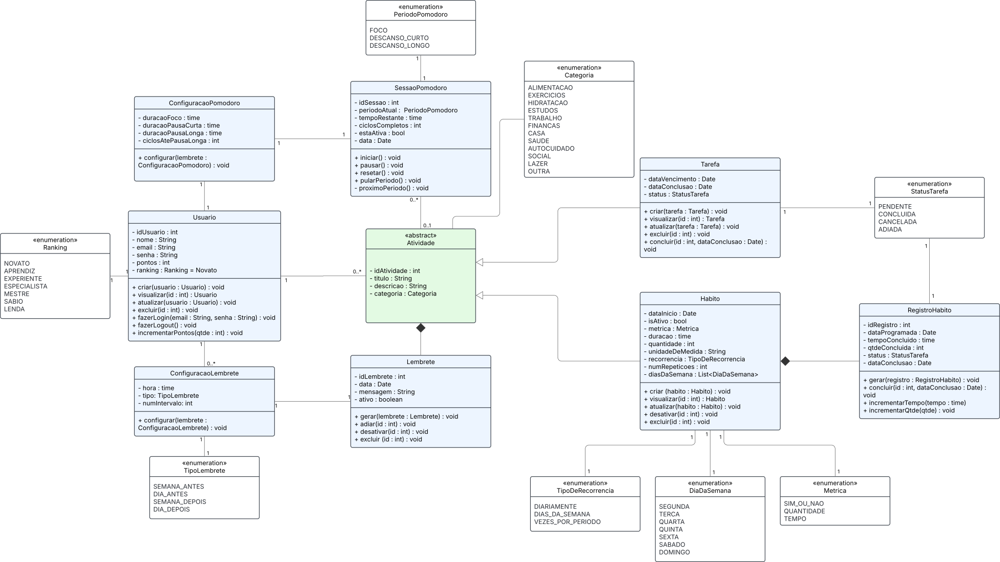
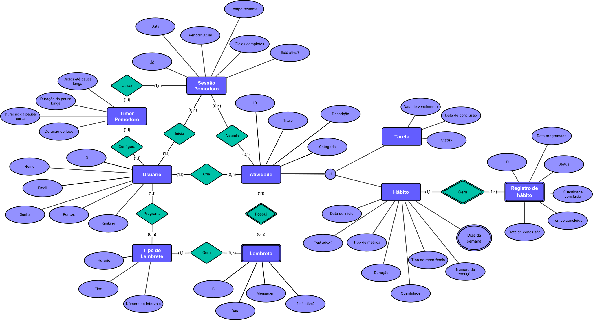
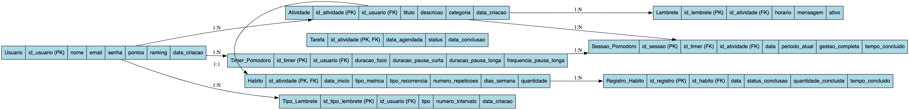

# Arquitetura da Solução

# Diagrama de Classes

# Modelo ER

# Esquema Relacional

# Modelo Físico
[banco.sql](../src/bd/banco.sql)

# Tecnologias Utilizadas

Tecnologias Utilizadas
Para a implementação da solução proposta, optou-se por um conjunto de tecnologias modernas e eficientes. A escolha se baseia na compatibilidade, na vasta comunidade de desenvolvedores e na facilidade de manutenção.

## Front-end

React Native: É o principal framework para o desenvolvimento do aplicativo. Ele permite criar uma aplicação nativa para iOS e Android a partir de uma única base de código JavaScript, otimizando o tempo e os recursos de desenvolvimento.

Expo: Uma plataforma de desenvolvimento para React Native que simplifica a criação, a construção e a implantação do aplicativo. Ele oferece ferramentas e serviços que aceleram o processo, como notificações push e acesso à câmera, sem a necessidade de configurações complexas.

React Navigation: Biblioteca de roteamento para gerenciar a navegação entre as diferentes telas do aplicativo, como a tela de login, a tela inicial e a tela de relatórios.

AsyncStorage: Um sistema de armazenamento de dados local assíncrono. Será utilizado para persistir informações como os dados do usuário, tarefas, hábitos e configurações de forma segura no dispositivo.

## Back-end
C#: Linguagem de programação utilizada para desenvolvimento da API Back-end

ASPNET Core 8.0: framework de desenvolvimento web utilizado para desenvolvimento da API REST.

Entity Framework Core: utilizado como ORM (Object-Relational Mapping).

Swagger (OpenAPI): utilizado para projetar, construir e documentar a API REST.

SQL Server: banco de dados relacional utilizado para armazenamento persistente dos dados da aplicação.

## Ferramentas e Outros
Figma: Ferramenta de design de interface e experiência do usuário (UX/UI) utilizada para prototipar a interface do aplicativo, garantindo um design limpo e intuitivo antes da codificação.

VS Code (Visual Studio Code): O ambiente de desenvolvimento integrado (IDE) principal para a equipe, oferecendo suporte robusto a JavaScript, React Native e outras tecnologias do projeto.

Visual Studio: IDE utilizada para desenvolvimento da API Back-end.

Git e GitHub: Sistema de controle de versão e plataforma de hospedagem de código. Essenciais para o trabalho colaborativo da equipe, permitindo o gerenciamento de versões e o rastreamento de alterações no código-fonte.

Azure: plataforma utilizada para hospedar a API back-end e o banco de dados.

## Hospedagem

### API REST Back-end 

A API back-end foi hospedada na plataforma Microsoft Azure. Para isso, foram seguidos os seguintes passos:

- Criação de um novo grupo de recursos, que contém a aplicação e o banco de dados;
- Criação de novo recurso de Serviço de Aplicativo a partir do GitHub Actions;
- Configuração do workflow no GitHub Actions;
- Criação de novo recurso SQL Server;
- Conexão do Serviço de Aplicativo com o SQL Server criado.

#### Link do endpoint

https://rotinize-api-dev-c4c4c5cqc5e8gaba.brazilsouth-01.azurewebsites.net/

Para utilizar a API, é necessário realizar requisições HTTP por meio de um cliente HTTP, como Postman ou Insomnia. A seguir está a coleção com as requisições disponibilizadas ela API:

[Coleção de requisições HTTP](./rotinize_collection.yaml)

## Qualidade de Software

A avaliação da qualidade do aplicativo é baseada no modelo ISO/IEC 25010, que define oito características principais. Para cada característica, foram selecionadas as subcaracterísticas mais relevantes ao contexto do projeto, acompanhadas de suas justificativas.

### 1. Adequação Funcional
- **Completude funcional:** Garantir que o aplicativo ofereça todas as funções essenciais para registro de hábitos, tarefas, relatórios e recursos de gamificação.
  
### 2. Eficiência de Desempenho
- **Tempo de resposta:** As funcionalidades devem ser executadas em tempo adequado, mantendo a fluidez da experiência.  
- **Utilização de recursos:** O aplicativo deve consumir poucos recursos de bateria e memória em dispositivos móveis.

### 3. Compatibilidade
- **Interoperabilidade:** O sistema deve permitir integração com notificações nativas do sistema operacional.  
- **Coexistência:** Deve funcionar em paralelo com outros aplicativos sem comprometer o desempenho do dispositivo.
  
### 4. Usabilidade
- **Operacionalidade:** Interface intuitiva e de fácil navegação.  
- **Apreensibilidade:** Aprendizado rápido das principais funções.    
- **Estética da Interface:** Layout agradável e motivador para estimular o uso contínuo.   

### 5. Confiabilidade
- **Disponibilidade:** O aplicativo deve estar acessível sempre que necessário.  
- **Tolerância a falhas:** Deve se recuperar de erros sem comprometer dados do usuário.

### 6. Segurança
- **Confidencialidade:** Garantir proteção dos dados contra acessos não autorizados.  
- **Integridade:** Manter consistência e precisão das informações armazenadas.

### 7. Manutenibilidade
- **Modificabilidade:** Permitir evoluções e ajustes sem impactar módulos já existentes.   
- **Testabilidade:** Estruturação que facilite testes automatizados e de integração.

### 8. Portabilidade
- **Adaptabilidade:** Compatibilidade com diferentes versões de Android e iOS.  
- **Instalabilidade:** A instalação deve ser simples, feita diretamente pelas lojas de aplicativos oficiais.

